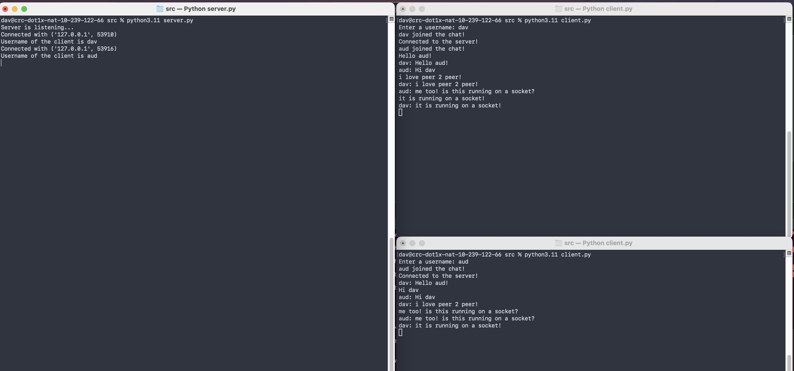

# p2p_ec530

Peer to peer project for EC530

David LI

Simple peer 2 peer chatroom through terminal with python sockets and threading implemented. Server allows users to create socket between each other so that they can communicate peer2peer. Works for as many users as can be handled! Security and extra chatting features to be implemented soon! :) Database logging for user text supported! Databases are stored locally on the user's machine. clean_db.py wipes user's database.

## To run:

1. Start the server on a terminal instance: ```python3.11 server.py```

2. Log in as a user with ```python3.11 client.py```

3. Set a username and chat away with anyone else who has connected!

## Examples
<p align="center">

</p>
<p align="center">
Server running of the left side. Two users logged in on the right side.
</p>
